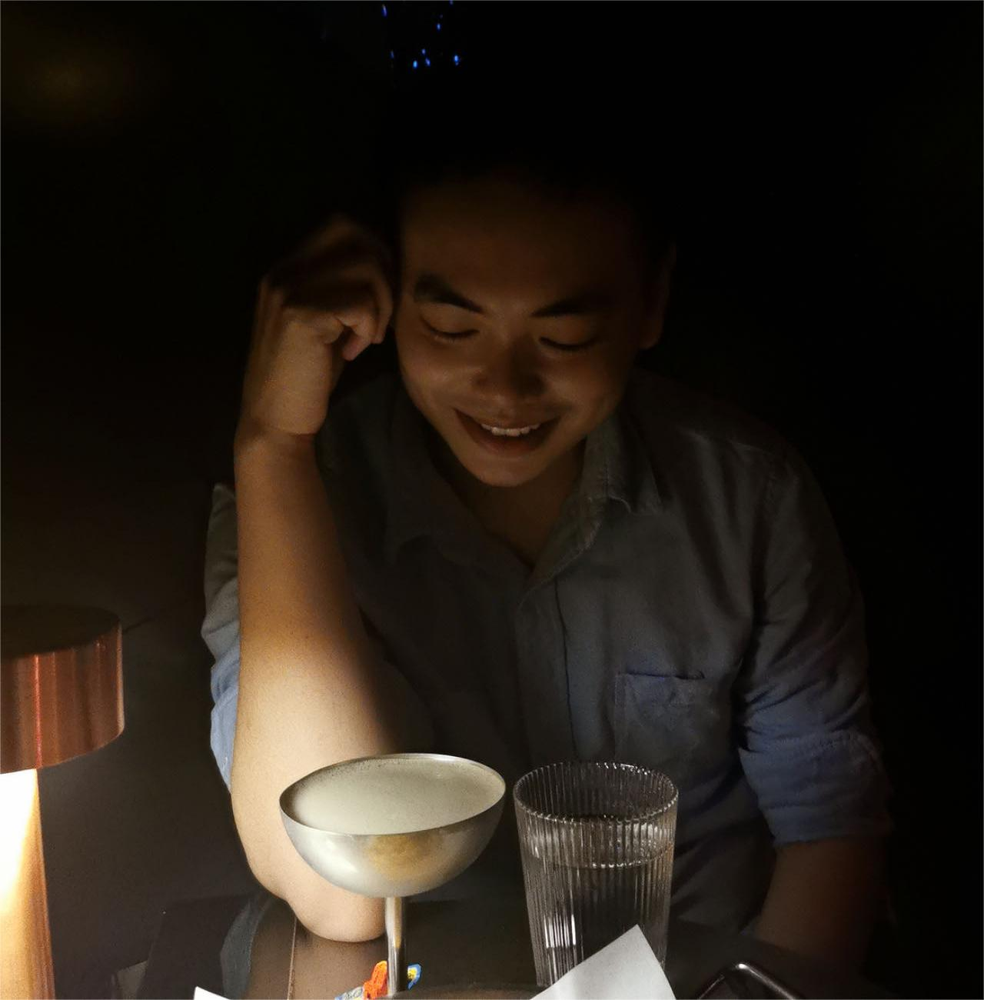

# About Me

我叫 **谭建生**。我毕业于东北林业大学，主修交通工程，并在香港城市大学获得了建筑与土木工程的硕士学位。自2020年以来，我在金茂商业房地产（上海）有限公司担任计划运营主管，负责综合体商业改造筹备、开业、经营全周期工作。我拥有优秀的PPT撰写能力、良好的数据分析技能，熟练使用autoCAD、xmind，并且熟悉Python和Photoshop。此外，我还通过了英语CET-6考试，雅思成绩为6.5。

Hello, my name is **JianSheng Tan**. I graduated from Northeast Forestry University with a major in Traffic Engineering and earned a Master's degree in Civil and Structural Engineering from City University of Hong Kong. Since 2020, I have been working as a Planning and Operations Manager at Jinmao Commercial Real Estate (Shanghai) Co., Ltd., where I am involved in the entire cycle of commercial complex renovation, opening, and operations. I possess excellent skills in PPT creation, good data analysis capabilities, and am proficient in autoCAD and xmind, with familiarity in Python and Photoshop. Additionally, I have passed the CET-6 English exam and achieved a 6.5 in IELTS.

## Academic Background

- **Sep 2014 - June 2018:** Northeast Forestry University (BEng)
- **Sep 2018 - Nov 2019:** City University of HongKong (BSc)

 

---

<!--## Research Interests

- Internet of Everything (IoE)
- Industrial Automation
- Network and Cybersecurity
- Applied Machine Learning
- [My latest research proposal](https://caihanlin.com/file/proposal-2023.pdf) 🔗

My current research focuses on practical problems that artificial intelligence faces in real life. My interests are on the **Machine Learning** and its applications in **Industrial IoT**. In a word, advanced technologies like ML and IoT positively influence the life of everybody.  I wish to devote my talent to this meaningful cause and bring well-being to society.

 

---

## News and Updates

- **Dec 2023：**Very excited to be selected as [AAAI-24 UC Scholar](https://aaai-uc.github.io/), see you in Canada!
- **Dec 2023：**Got a MSc offer from the physics department at Imperial College London.
- **Aug 2023：**Happy to be awarded the FEPG Scholarship.
- **May 2023：**Happy to be awarded the XiamenAir Scholarship.
- **May 2023：**Collected the Finalist Award in MCM 2023 (Top 1%).
- **Jan 2023：**One paper accepted to ICAROB 2023, see you in Japan (online).
- **Jun 2022：**Started research program at [Cambridge AI Group](https://www.cl.cam.ac.uk/research/ai/), advised by Prof. Pietro Liò.

 

<blockquote class="twitter-tweet">
I&#39;m thrilled to share that I have been awarded the AAAI 2024 Undergraduate Scholarship and will be attending the AAAI Conference in Vancouver this coming February.  I am also looking for PhD to start in 2025 Fall. Contact me if you have any leads! 😁 <a href="https://t.co/GxdTPnCzE6">pic.twitter.com/GxdTPnCzE6</a>
&mdash; Hanlin CAI (seeking a PhD position 2025) (@lancecai2002) <a href="https://twitter.com/lancecai2002/status/1738533328490463639?ref_src=twsrc%5Etfw">December 23, 2023</a></blockquote> 
-->